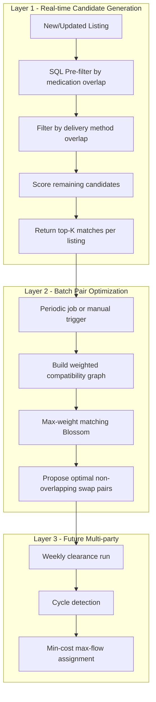

# DaruGard – Matching Algorithm Analysis

## Problem Statement

DaruGard connects pharmacies that want to exchange medications. Each **listing** (advertisement) now carries:

- **Offered medications** — what the pharmacy has available
- **Accepted medications** — what the pharmacy is willing to receive in exchange (for SWAP listings)
- **Delivery methods** — how the pharmacy prefers to exchange (PICKUP, COURIER, POST, INTERCITY_FREIGHT)

The matching problem is: given a set of active listings, find compatible pairs (or cycles) where pharmacy A's offered medications overlap pharmacy B's accepted medications **and vice versa**, with compatible delivery preferences.

This is a **barter / exchange matching** problem, not a simple assignment problem.

---

## Algorithm Options Evaluated

### 1. Hungarian Algorithm (Kuhn–Munkres)

**What it solves:** Optimal one-to-one assignment on a bipartite graph (e.g., assign N workers to N jobs minimizing total cost).

**Complexity:** O(n³)

| Criterion | Assessment |
|-----------|------------|
| Performance | Excellent for balanced one-to-one problems up to ~10,000 nodes |
| Scalability | Poor fit — our problem is many-to-many with medication sets, not 1:1 assignment |
| Accuracy | Optimal for assignment, but only if the problem is correctly modeled as bipartite 1:1 |
| Fit for DaruGard | **Poor** as primary algorithm |

**Why it doesn't fit directly:**
- A pharmacy can offer multiple medications and accept multiple medications.
- One listing can match multiple other listings (not exclusive assignment).
- Multi-party swap cycles (A→B→C→A) are invisible to the Hungarian algorithm.
- Delivery method compatibility adds a constraint dimension that doesn't map cleanly to a cost matrix.

**When it could be useful:** As a sub-routine inside a confirmed negotiation phase — once two pharmacies have narrowed to a single medication pair each, assign optimal pairings in a batch clearance run.

---

### 2. Greedy / Scoring Candidate Generation

**What it solves:** Rank potential matches by a composite compatibility score and return the top-K candidates per listing.

**Complexity:** O(n × m) for naive pairwise scan; O(n log n) with pre-filtered indexes

| Criterion | Assessment |
|-----------|------------|
| Performance | Very fast; suitable for real-time feed generation |
| Scalability | Scales linearly with listing count; indexable by medication ID |
| Accuracy | Good for discovery; not optimal for final assignment |
| Fit for DaruGard | **Excellent** as Layer 1 (candidate generation) |

**Scoring formula (proposed):**

```typescript
interface MatchScore {
  medicationOverlap: number;    // |A.offered ∩ B.accepted| + |B.offered ∩ A.accepted|
  deliveryCompatibility: number; // shared delivery methods / total methods
  geographicProximity: number;  // from metadata.location (Phase 2)
  urgencyWeight: number;        // from metadata.urgencyLevel
  reputationScore: number;      // pharmacy reputation (Phase 2)
}

function computeScore(s: MatchScore): number {
  return (
    s.medicationOverlap      * 0.40 +
    s.deliveryCompatibility  * 0.25 +
    s.geographicProximity    * 0.15 +
    s.urgencyWeight          * 0.10 +
    s.reputationScore        * 0.10
  );
}
```

**Implementation approach:**
1. Pre-filter: only consider listings where `A.offered ∩ B.accepted ≠ ∅ AND B.offered ∩ A.accepted ≠ ∅`.
2. Pre-filter: delivery method intersection is non-empty.
3. Score remaining pairs and return top-K per listing.

**SQL-friendly pre-filter (using join tables):**

```sql
-- Find listings compatible with listing :sourceId
SELECT DISTINCT l2.*
FROM listings l1
JOIN listing_offered_medications lom1 ON lom1.listing_id = l1.id
JOIN listing_wanted_medications lwm2 ON lwm2.medication_id = lom1.medication_id
JOIN listings l2 ON l2.id = lwm2.listing_id
JOIN listing_offered_medications lom2 ON lom2.listing_id = l2.id
JOIN listing_wanted_medications lwm1 ON lwm1.listing_id = l1.id
  AND lwm1.medication_id = lom2.medication_id
WHERE l1.id = :sourceId
  AND l2.id != l1.id
  AND l1.deleted_at IS NULL AND l2.deleted_at IS NULL
  AND l1.status = 'ACTIVE' AND l2.status = 'ACTIVE'
  AND l1.delivery_methods && l2.delivery_methods;  -- array overlap
```

---

### 3. Maximum-Weight Matching (Blossom / Edmonds)

**What it solves:** Find the maximum-weight set of non-overlapping pairs in a general graph.

**Complexity:** O(n³) for Blossom algorithm

| Criterion | Assessment |
|-----------|------------|
| Performance | Good for hundreds to low thousands of listings per batch run |
| Scalability | Batch-oriented; not real-time for large graphs |
| Accuracy | Optimal pairwise matching; handles weighted edges |
| Fit for DaruGard | **Good** as Layer 2 (confirmed pairwise swaps) |

**How to model:**
- Nodes = active listings
- Edge between A and B exists if mutual medication compatibility + delivery overlap
- Edge weight = composite match score from Layer 1
- Run max-weight matching to find the best non-overlapping set of swap pairs

**Libraries:** `graphlib` (JS), `networkx` (Python), or a custom Blossom implementation.

---

### 4. Min-Cost Max-Flow / Cycle Cover

**What it solves:** Multi-party exchange cycles (A gives to B, B gives to C, C gives to A) — analogous to kidney exchange algorithms.

**Complexity:** O(n² × m) for min-cost flow; cycle enumeration can be exponential in worst case

| Criterion | Assessment |
|-----------|------------|
| Performance | Expensive for large graphs; suitable for periodic batch optimization |
| Scalability | Limited to batch runs (nightly/weekly clearance) |
| Accuracy | Optimal for multi-party cycles |
| Fit for DaruGard | **Future** (Phase 3+) — when multi-way swaps become a product requirement |

**When to adopt:** When pharmacies frequently have partial overlaps that only resolve through 3+ party cycles (e.g., A has drug X wants Y, B has Y wants Z, C has Z wants X).

---

### 5. Stable Matching (Gale–Shapley)

**What it solves:** Stable one-to-one matching where no pair prefers each other over their assigned match.

| Criterion | Assessment |
|-----------|------------|
| Fit for DaruGard | **Poor** — assumes exclusive preferences and 1:1 matching |

Not recommended for DaruGard's open marketplace model.

---

## Comparison Summary

| Algorithm | Best For | Real-time? | Multi-party? | Many-to-many? | Recommended Phase |
|-----------|----------|------------|--------------|---------------|-----------------|
| Hungarian | 1:1 assignment | Batch | No | No | Sub-routine only |
| Greedy/Scoring | Candidate feed | Yes | No | Yes | **Phase 1 (now)** |
| Max-weight matching | Optimal pairs | Batch | No | Partial | **Phase 2** |
| Min-cost flow | Multi-party cycles | Batch | Yes | Yes | Phase 3+ |
| Stable matching | Exclusive pairing | No | No | No | Not recommended |

---

## Recommendation: Two-Layer Architecture



### Layer 1 — Implement First (Phase 1.5)
- Endpoint: `GET /api/v1/listings/:id/matches`
- Uses SQL join-table pre-filter + scoring function
- Returns ranked candidates with score breakdown
- Fast enough for real-time UI ("Suggested matches for your listing")
- Builds on existing [05-matching-engine.md](05-matching-engine.md) scoring framework

### Layer 2 — Implement Next (Phase 2)
- Background job: `matching.run` (BullMQ)
- Runs max-weight matching on the active listing graph
- Produces proposed swap pairs for pharmacy confirmation
- Hungarian algorithm is **not** the right tool here; use Blossom/max-weight matching instead

### Layer 3 — Future (Phase 3+)
- Multi-party cycle detection for complex barter chains
- Min-cost max-flow when 3+ party swaps become common

---

## Why Not Hungarian as Primary?

The Hungarian algorithm is optimal for **assignment problems** where:
- Each agent is assigned exactly one task
- The cost matrix is fully defined
- Assignments are exclusive

DaruGard's marketplace has:
- **Many-to-many** medication relationships per listing
- **Non-exclusive** matches (one listing can match many others simultaneously)
- **Mutual consent** required (both pharmacies must agree)
- **Potential multi-party cycles** in the future

The Hungarian algorithm would force an artificial 1:1 mapping that doesn't reflect how pharmacies actually exchange inventory. It would also miss valid matches when the marketplace is unbalanced (more OFFERs than NEEDs).

---

## Performance Estimates

| Listings | Layer 1 (SQL + score) | Layer 2 (Blossom) | Layer 3 (min-cost flow) |
|----------|----------------------|-------------------|------------------------|
| 100 | < 50ms | < 100ms | < 500ms |
| 1,000 | < 200ms | < 2s | < 10s |
| 10,000 | < 1s (with indexes) | < 30s | minutes (batch only) |
| 100,000 | < 5s (with indexes) | minutes (batch only) | hours (batch only) |

Indexes required for Layer 1 at scale:
- `listing_offered_medications(medication_id)`
- `listing_wanted_medications(medication_id)`
- GIN index on `listings.delivery_methods` (Postgres array overlap)

---

## Conclusion

**Use greedy/scoring for real-time candidate generation (Layer 1) and max-weight matching for batch pair optimization (Layer 2).** Reserve the Hungarian algorithm only as a potential sub-routine for narrow 1:1 assignment sub-problems. Reserve min-cost max-flow for future multi-party swap cycles.

This two-layer approach provides the best balance of **performance** (real-time feeds), **scalability** (indexable SQL pre-filters), and **matching accuracy** (optimal pairwise assignment in batch runs) for DaruGard's pharmacy barter marketplace.
