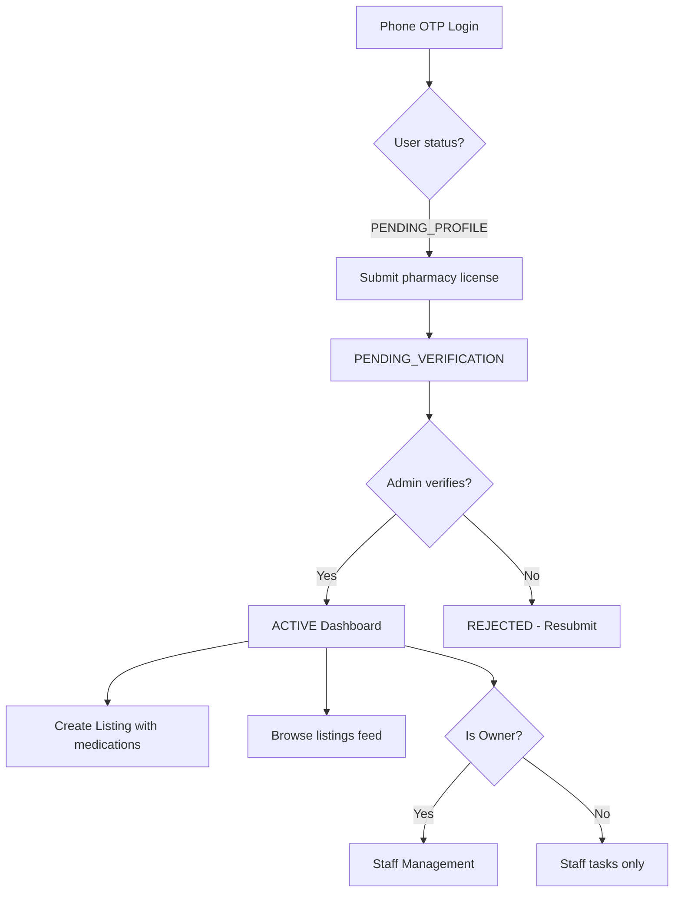

# DaruGard Frontend Actions

This document describes the backend API changes that require frontend implementation. Use this as the source of truth when building UI in the separate frontend repository.

**Base URL:** `http://localhost:3001/api/v1` (dev)  
**Auth:** `Authorization: Bearer <accessToken>` (JWT from OTP login)  
**Response envelope:** All success responses are wrapped as `{ data: ... }`

---

## 1. Medication Catalog (Search & Select)

### Purpose
When creating an advertisement (listing), pharmacists must select one or more medications from a catalog. At least one offered medication is required.

### Endpoints

#### `GET /medications?q=&page=&limit=`
Public endpoint. Search medications for the multi-select picker.

**Query params:**
| Param | Type | Default | Description |
|-------|------|---------|-------------|
| `q` | string | — | Search by name or generic name |
| `page` | number | 1 | Page number |
| `limit` | number | 20 | Items per page (max 100) |

**Response:**
```json
{
  "data": {
    "items": [
      {
        "id": "uuid",
        "name": "آموکسی‌سیلین ۵۰۰ میلی‌گرم",
        "genericName": "Amoxicillin",
        "form": "کپسول",
        "strength": "500mg",
        "atcCode": "J01CA04"
      }
    ],
    "total": 8,
    "page": 1,
    "limit": 20,
    "totalPages": 1
  }
}
```

#### `GET /medications/:id`
Public endpoint. Get a single medication by ID.

### UI to Build
- **Medication multi-select component** with async search (debounced `GET /medications?q=...`)
- Display: `name` + `strength` + `form` in the dropdown
- Selected medications shown as chips/tags
- Minimum 1 medication required before submit

---

## 2. Create Advertisement (Listing) — Updated Payload

### Purpose
Pharmacists create advertisements specifying offered medications, accepted-in-exchange medications (for swaps), delivery preferences, and optional notes.

### Endpoint

#### `POST /listings` (JWT required)
Create a new listing/advertisement.

**Request body:**
```json
{
  "type": "SWAP",
  "offeredMedicationIds": ["uuid-1", "uuid-2"],
  "acceptedMedicationIds": ["uuid-3"],
  "deliveryMethods": ["PICKUP", "COURIER"],
  "rawText": "Optional free-text notes about condition, expiry, etc.",
  "metadata": {
    "expiryDate": "2026-06-30",
    "condition": "Unopened, stored at room temperature",
    "urgencyLevel": 3,
    "quantity": { "value": 5, "unit": "boxes" },
    "location": { "city": "تهران", "province": "تهران", "country": "IR" }
  }
}
```

**Field rules:**
| Field | Required | Notes |
|-------|----------|-------|
| `type` | Yes | `OFFER` \| `NEED` \| `SWAP` |
| `offeredMedicationIds` | Yes | Array of UUIDs, min 1 |
| `acceptedMedicationIds` | When `type=SWAP` | Array of UUIDs, min 1 |
| `deliveryMethods` | Yes | Array, min 1. Values: `PICKUP`, `COURIER`, `POST`, `INTERCITY_FREIGHT` |
| `rawText` | No | Optional notes, max 2000 chars |
| `metadata` | No | Same as before (expiry, condition, urgency, location, quantity, images) |

**Response:**
```json
{
  "data": {
    "id": "uuid",
    "pharmacyId": "uuid",
    "type": "SWAP",
    "rawText": "Optional notes",
    "metadata": {},
    "status": "ACTIVE",
    "deliveryMethods": ["PICKUP", "COURIER"],
    "offeredMedications": [
      { "id": "uuid", "name": "آموکسی‌سیلین ۵۰۰ میلی‌گرم", "genericName": "Amoxicillin", "form": "کپسول", "strength": "500mg" }
    ],
    "acceptedMedications": [
      { "id": "uuid", "name": "متفورمین ۱۰۰۰ میلی‌گرم", "genericName": "Metformin", "form": "قرص", "strength": "1000mg" }
    ],
    "createdAt": "2026-07-10T...",
    "updatedAt": "2026-07-10T..."
  }
}
```

**Auth gates:**
- User must be `ACTIVE` (verified pharmacy)
- User must have a `pharmacyId`
- `pharmacyId` is derived from JWT — do NOT send it in the body

### UI to Build — Create Advertisement Form

```
┌─────────────────────────────────────────────┐
│  Create Advertisement                        │
├─────────────────────────────────────────────┤
│  Type:  ○ OFFER  ○ NEED  ○ SWAP            │
│                                              │
│  Medications Offered *                       │
│  [🔍 Search medications...]                │
│  [Amoxicillin 500mg ×] [Metformin 1000mg ×]│
│                                              │
│  Medications Accepted in Exchange            │
│  (shown only when type = SWAP) *             │
│  [🔍 Search medications...]                │
│  [Insulin Glargine ×]                       │
│                                              │
│  Delivery Methods *                          │
│  ☑ Pickup  ☑ Courier  ☐ Post  ☐ Freight   │
│                                              │
│  Notes (optional)                            │
│  [Free-text textarea...]                    │
│                                              │
│  ── Optional Details ──                     │
│  Expiry date, condition, urgency, quantity   │
│                                              │
│  [Create Advertisement]                      │
└─────────────────────────────────────────────┘
```

**Behavior:**
1. On mount, no medications pre-loaded; user searches via `GET /medications?q=`
2. When type changes to `SWAP`, show the "Accepted in Exchange" multi-select (required)
3. When type is `OFFER` or `NEED`, hide accepted medications field
4. Delivery methods: at least one checkbox must be selected
5. On submit, POST to `/listings` with JWT header
6. Show validation errors from 400 responses

### Delivery Method Labels (for UI)
| Value | Persian Label | English |
|-------|--------------|---------|
| `PICKUP` | تحویل حضوری | Pickup |
| `COURIER` | پیک | Courier |
| `POST` | پست | Post |
| `INTERCITY_FREIGHT` | باربری بین‌شهری | Intercity Freight |

---

## 3. Browse Listings — Updated Response

### `GET /listings` (public)
Response now includes `offeredMedications`, `acceptedMedications`, and `deliveryMethods` on each listing item. Update the listing card/feed component to display:
- Medication chips (offered)
- Accepted medications (for SWAP type)
- Delivery method badges

---

## 4. Pharmacy Staff Management

### Purpose
After pharmacy verification, the owner can create staff accounts so employees can log in and perform tasks under the pharmacy's permissions.

### Endpoints (all JWT required, owner only)

#### `POST /pharmacies/staff`
Create a staff account.

**Request:**
```json
{
  "phone": "09123456789",
  "fullName": "علی رضایی",
  "role": "STAFF"
}
```

| Field | Required | Notes |
|-------|----------|-------|
| `phone` | Yes | Iranian mobile (09xxxxxxxxx) |
| `fullName` | Yes | Staff member name |
| `role` | Yes | `STAFF` or `MANAGER` |

**Response:**
```json
{
  "data": {
    "id": "uuid",
    "phone": "09123456789",
    "fullName": "علی رضایی",
    "role": "STAFF",
    "status": "ACTIVE",
    "createdAt": "2026-07-10T..."
  }
}
```

**Errors:**
- `409` — phone already registered
- `403` — not owner, pharmacy not verified, or owner not active

#### `GET /pharmacies/staff`
List all staff for the owner's pharmacy (excludes owner).

**Response:**
```json
{
  "data": [
    {
      "id": "uuid",
      "phone": "09123456789",
      "fullName": "علی رضایی",
      "role": "STAFF",
      "status": "ACTIVE",
      "createdAt": "2026-07-10T..."
    }
  ]
}
```

#### `DELETE /pharmacies/staff/:id`
Deactivate a staff member (soft-delete + suspend).

**Response:** `200` with empty data or `204`.

### UI to Build — Staff Management Screen

**Visibility:** Only shown when `user.role === 'OWNER'` AND `user.status === 'ACTIVE'` AND pharmacy is verified.

**Location:** Dashboard sidebar → "Staff Management" / "مدیریت پرسنل"

```
┌─────────────────────────────────────────────┐
│  Staff Management                            │
├─────────────────────────────────────────────┤
│  [+ Add Staff Member]                        │
│                                              │
│  ┌──────────────────────────────────────┐   │
│  │ علی رضایی          STAFF    ACTIVE   │   │
│  │ 09123456789              [Remove]   │   │
│  └──────────────────────────────────────┘   │
│  ┌──────────────────────────────────────┐   │
│  │ مریم احمدی       MANAGER   ACTIVE   │   │
│  │ 09129876543              [Remove]   │   │
│  └──────────────────────────────────────┘   │
└─────────────────────────────────────────────┘
```

**Add Staff Modal:**
```
┌─────────────────────────────────────────────┐
│  Add Staff Member                            │
├─────────────────────────────────────────────┤
│  Full Name *    [________________]           │
│  Phone *        [09__________]               │
│  Role *         ○ Staff  ○ Manager           │
│                                              │
│  [Cancel]  [Create Account]                  │
└─────────────────────────────────────────────┘
```

**Staff login flow:**
1. Owner creates staff account via `POST /pharmacies/staff`
2. Staff receives their phone number (no SMS invitation yet — they use standard OTP login)
3. Staff opens app → enters phone → receives OTP → logs in
4. Staff sees the pharmacy dashboard with their role permissions
5. Staff can create listings (if ACTIVE) under the pharmacy's account

---

## 5. User Journey (Updated)



---

## 6. API Client Types (TypeScript)

```typescript
// Medications
interface Medication {
  id: string;
  name: string;
  genericName: string | null;
  form: string | null;
  strength: string | null;
  atcCode: string | null;
}

// Delivery
type DeliveryMethod = 'PICKUP' | 'COURIER' | 'POST' | 'INTERCITY_FREIGHT';

// Create Listing
interface CreateListingRequest {
  type: 'OFFER' | 'NEED' | 'SWAP';
  offeredMedicationIds: string[];
  acceptedMedicationIds?: string[];
  deliveryMethods: DeliveryMethod[];
  rawText?: string;
  metadata?: {
    expiryDate?: string;
    condition?: string;
    urgencyLevel?: 1 | 2 | 3 | 4 | 5;
    location?: { city?: string; province?: string; country?: string };
    quantity?: { value: number; unit: string };
    images?: string[];
    preferredExchangeType?: 'sale' | 'trade' | 'donation';
  };
}

// Listing Response
interface Listing {
  id: string;
  pharmacyId: string;
  type: 'OFFER' | 'NEED' | 'SWAP';
  rawText: string;
  metadata: Record<string, unknown>;
  status: 'ACTIVE' | 'PENDING' | 'CLOSED';
  deliveryMethods: DeliveryMethod[];
  offeredMedications: MedicationSummary[];
  acceptedMedications: MedicationSummary[];
  createdAt: string;
  updatedAt: string;
}

interface MedicationSummary {
  id: string;
  name: string;
  genericName: string | null;
  form: string | null;
  strength: string | null;
}

// Staff
interface CreateStaffRequest {
  phone: string;
  fullName: string;
  role: 'STAFF' | 'MANAGER';
}

interface StaffMember {
  id: string;
  phone: string;
  fullName: string | null;
  role: 'STAFF' | 'MANAGER';
  status: string;
  createdAt: string;
}
```

---

## 7. Pages / Components Checklist

| Component | Priority | Description |
|-----------|----------|-------------|
| `MedicationSearchSelect` | P0 | Async multi-select with search, used in listing form |
| `CreateListingForm` | P0 | Updated form with medication selects + delivery checkboxes |
| `ListingCard` | P0 | Updated to show medication chips + delivery badges |
| `StaffManagementPage` | P1 | Owner-only page to list/add/remove staff |
| `AddStaffModal` | P1 | Modal form for creating staff accounts |
| `DeliveryMethodCheckboxes` | P0 | Reusable checkbox group for delivery methods |

---

## 8. Existing Endpoints (unchanged)

These endpoints work as before — refer to Swagger at `/swagger` for full docs:

| Endpoint | Auth | Purpose |
|----------|------|---------|
| `POST /auth/otp/request` | No | Request OTP |
| `POST /auth/otp/verify` | No | Verify OTP → JWT |
| `GET /auth/me` | JWT | Current user profile |
| `POST /pharmacies/license` | JWT | Submit pharmacy license |
| `GET /pharmacies/me` | JWT | Get pharmacy profile |
| `GET /listings` | No | Browse/search listings |
| `GET /listings/:id` | No | Get single listing |
| `DELETE /listings/:id` | No | Soft-delete listing |
